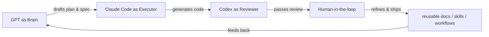

## Hi, I'm threetwoa

# Code less, Architect more.

Building AI coding workflows, Web3 demos, and reusable knowledge assets.

  
  
  
  
  
  

太原 · 大二 · 软件工程

---

## About

I'm a sophomore software engineering student in Taiyuan, currently spending most of my time between hackathons, AI coding tools, and building small but reusable systems. My background is full-stack curious, but my real interest sits at the intersection of **frontend craft** and **AI-assisted engineering workflow**.

I don't just want AI to write code for me. I'm trying to move from vibe coding to **spec-driven, workflow-driven building** — organizing prompts, tools, MCP servers, skills, review loops, and docs into repeatable systems that survive beyond a single chat session.

---

## Projects

### AgentCFO

> DAO AI 财务官 · Web3 hackathon team project

A DAO-facing AI finance officer. I joined as **frontend lead / contributor**, focused on demo experience, visual delivery, and frontend polish for the hackathon presentation.

[repo](https://github.com/San-Y108/agent-cfo) · [demo](https://agentcfo-frontend.vercel.app/)

### threetwoa-cc-workshop

> AI Workflow Operating System · Claude Code 配置工坊 & 知识资产库

My personal workspace for turning AI coding experiments into reusable assets. It covers GPT → Claude Code → Codex workflows, plus MCP, skills, prompts, checklists, and docs that I actually reuse.

[repo](https://github.com/Aafff623/threetwoa-cc-workshop)

---

## Workflow Map

---

## Stack

**Backend:** Java Spring Boot, Spring Cloud, Python FastAPI  
**Frontend:** React, Vue, Tailwind CSS, Framer Motion  
**UI / Design Assets:** HeroUI v3, Makedirs, Aceternity UI, motionsites.ai, Lovable, OpenDesign  
**Motion:** GSAP, Vibe Motion  
**AI Coding Workflow:** Claude Code, Cursor, Codex, MCP, Skills, Spec-driven development  
**Web3:** EVM basics, hackathon demos, Vercel deployments

---

  <i>Build less, reuse more.</i>

