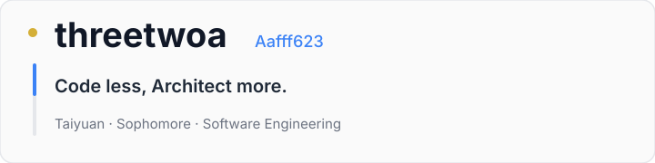
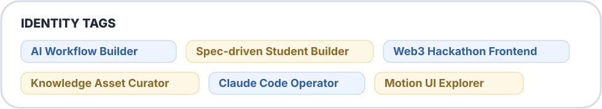
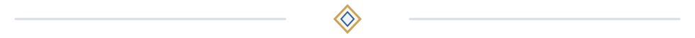
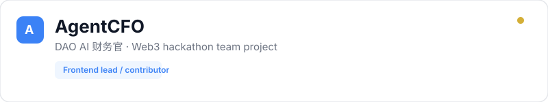
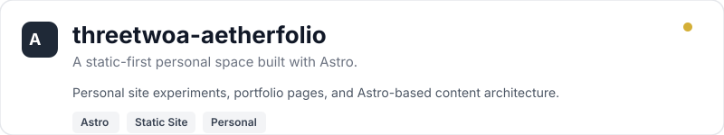
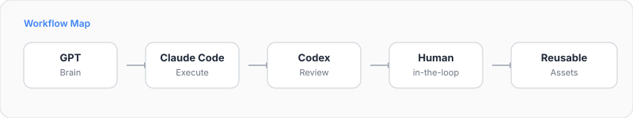

<table width="100%">
  <tr>
    <td width="58%" valign="top">
      
        
      
        
      

        Building AI coding workflows, Web3 demos, and reusable knowledge assets. 
        From vibe coding to spec-driven, workflow-driven building.
      

    </td>
    <td width="42%" align="center" valign="top">
      
    </td>
  </tr>
</table>

---

## Featured Projects

  <a href="https://github.com/San-Y108/agent-cfo">repo</a> ·
  <a href="https://agentcfo-frontend.vercel.app/">demo</a>

  <a href="https://github.com/Aafff623/threetwoa-aetherfolio">repo</a>

---

## Workflow

---

## Stack

  <strong>Backend:</strong> Java Spring Boot, Spring Cloud, Python FastAPI   
  <strong>Frontend:</strong> React, Vue, Tailwind CSS, Framer Motion   
  <strong>UI Assets:</strong> HeroUI v3, Makedirs, Aceternity UI, motionsites.ai, Lovable, OpenDesign, taste-skill   
  <strong>Motion:</strong> GSAP, Vibe Motion   
  <strong>AI Coding Workflow:</strong> Claude Code, Cursor, Codex, MCP, Skills, Spec-driven development   
  <strong>Web3:</strong> EVM basics, DAO payment workflow, hackathon demos

---

  <i>Build less, reuse more.</i>

