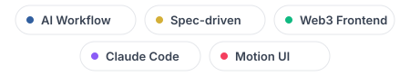
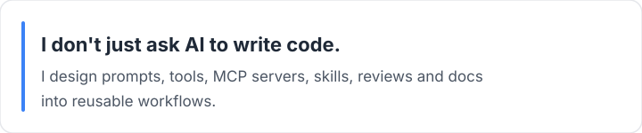

<h1 align="center">👋 Hi, I'm threetwoa</h1>

  

#

  
   
  

🌟 `vibe coding` 到 `spec-driven` 的探索者，专注 AI 编程工作流与 Web3 前端交付。

• 🧠 身份：**AI Workflow Builder** · **Spec-driven Student Builder**  
• 🏆 项目：[AgentCFO](https://github.com/San-Y108/agent-cfo) · [AI Workflow OS](https://github.com/Aafff623/threetwoa-cc-workshop)  
• ✉️ Email: `laiyif68@gmail.com`  
• 🌐 主页：[github.com/Aafff623](https://github.com/Aafff623)

我正在全力投入 `AI 编程工作流` 的探索，希望把 GPT、Claude Code、Codex、MCP、Skills 整合成稳定可复用的开发环境。

 

  
   
  

## 🛠️ 技术栈

  

  <i>最后更新：2026 年 6 月</i>

