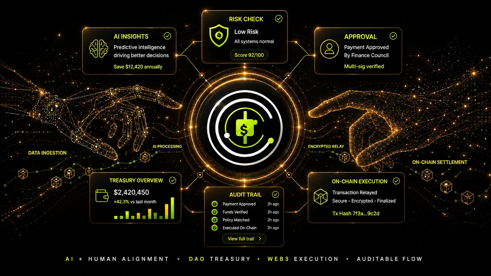

  

  <picture>
    <source media="(prefers-color-scheme: dark)" srcset="./assets/brand-threetwoa-dark.gif" />
    
  </picture>
   
  <i>⭐ Code Less, Architect More 🚀</i>

<table width="100%">
  <tr>
    <td width="60%" valign="top">
      
Hello. I'm an incoming third-year Software Engineering student at North University of China. 💻&#8288;(￣▽￣)

      
This summer: Java microservices &amp; middleware, LLM internals, and Spec-driven Coding under Harness Engineering. The honeymoon with vibe coding is over — I care about architecture, maintainability, and code built to last.

      
⚡&#8288;(¬‿¬) Fewer throwaway lines, more judgment and workflow.

      
What I'm practicing:

      <ul>
        <li><b>Build &amp; practice (Builder culture):</b> exploring modern open-source paradigms with a "build to understand" mindset — learning by doing via <a href="https://github.com/codecrafters-io/build-your-own-x">Build Your Own X</a> and CodeCrafters with toy projects (custom terminal Shell, mini-Redis, and minimal agent loops inspired by <a href="https://github.com/SaladDay/pi-from-scratch">pi-from-scratch</a>); built <a href="https://github.com/Aafff623/wolfcha"><b>wolfcha</b></a> (multi-agent social deduction game powered by DeepSeek/Qwen/Gemini) and <a href="https://github.com/Aafff623/pane"><b>pane</b></a> (Windows tray multi-plan AI tracker); internalizing agent architecture through <a href="https://github.com/datawhalechina/Hello-Agents">Hello-Agents</a> and Li Bojie's <a href="https://github.com/bojieli/ai-agent-book">ai-agent-book</a> across OpenCode and Harness Agents; adopting agile shipping from <a href="https://github.com/datawhalechina/easy-vibe">Easy-Vibe</a> and VibeHub while tending my digital garden.</li>
        <li><b>Practical stack &amp; data tooling:</b> payments, databases, WeChat ecosystem, Aliyun, UniApp, and CDP-based browser automation/scraping inspired by MediaCrawler; building full-stack applications like <a href="https://github.com/Aafff623/sky-out-ai"><b>sky-out-ai</b></a> (takeout AI reconstruction with customer service RAG); rotating thinking hats — PM, FDE, full-stack, hackathon builder.</li>
        <li><b>Open source:</b> digging into my own repos and community hotspots; learning from open-source architectures, cloning, experimenting, forking, and maintaining.</li>
        <li><b>Evals &amp; multimodal:</b> hands-on testing of domestic models (DeepSeek, GLM, Kimi) and the foreign big three (Anthropic, OpenAI, xAI). Wiring multimodal generation (MiniMax / StepFun for images, video, TTS, audio) into agent workflows, combined with custom utility Skills and MCP.</li>
        <li><b>My TTA Skills:</b> a personal agent toolkit under my handle initials (TTA) — <a href="https://github.com/Aafff623/tta-init"><code>tta-init</code></a> · <a href="https://github.com/Aafff623/tta-html"><code>tta-html</code></a> · <a href="https://github.com/Aafff623/tta-visual"><code>tta-visual</code></a> · <a href="https://github.com/Aafff623/tta-tone"><code>tta-tone</code></a> · <a href="https://github.com/Aafff623/tta-ppt"><code>tta-ppt</code></a> · <a href="https://github.com/Aafff623/tta-icon"><code>tta-icon</code></a> · <a href="https://github.com/Aafff623/tta-motion"><code>tta-motion</code></a> — covering workspace governance, HTML docs, manga/technical diagrams, bilingual tone, 16:9 decks, icon generation, and web motion.</li>
      </ul>
      
Outside tech I'm a cyclist 🚲 and follow bike racing — the Grand Tours and spring classics. I write a blog, tend a digital garden, track anime seasons, and keep a bit of warmth outside the screen that I don't want to lose.

    </td>
    <td width="40%" align="center" valign="middle">
      
    </td>
  </tr>
</table>

  
  &nbsp;&nbsp;&nbsp;&nbsp;
  
  &nbsp;&nbsp;&nbsp;&nbsp;
  
  &nbsp;&nbsp;&nbsp;&nbsp;
  
  &nbsp;&nbsp;&nbsp;&nbsp;
  
  &nbsp;&nbsp;&nbsp;&nbsp;
  
  &nbsp;&nbsp;&nbsp;&nbsp;
  
  &nbsp;&nbsp;&nbsp;&nbsp;
  
  &nbsp;&nbsp;&nbsp;&nbsp;
  
  &nbsp;&nbsp;&nbsp;&nbsp;
  

---

## Agent workflow

Coding agents are a fleet, not a single tool. Grok scouts real-time topics on the web (and I enjoy tinkering with Grokbot); GPT goes deep on research and requirement breakdowns; ~~previously used Claude Code routed to V4-Flash alongside MiniMax multimodal generation~~ — core development has shifted to **ZCode** running on the GLM Lite plan with **GLM 5.3 Flash**, taking full advantage of its Harness ecosystem and plugin marketplace; ~~OpenCode and Pi for lightweight tasks~~ — lightweight routines are now handed over to **Gemini 3.8 Flash** inside **Antigravity**; Cursor handles localized patches and quick inline refinements. I avoid reinventing wheels: configure each CLI with its matching Harness ecosystem and plugin registry, and maintain my custom `harness-sync` skill to synchronize and iterate cross-tool configurations in one click. The harness matters more than the prompt: scoped context, repository rules, deterministic commands, tests, clean docs, and a careful final diff review. 📋&#8288;(・ω・)ノ Architectural judgment and every merge stay with me.

---

## Tech stack

<table width="100%">
  <tr>
    <td width="40%" valign="top">
      
<b>Frontend &amp; Fullstack</b> 
      
      
      
      
      

      
<b>Java / Spring</b> 
      
      
      
      
      

      
<b>Middleware &amp; microservices</b> 
      
      
      
      
      
      
      
      

    </td>
    <td width="40%" valign="top">
      
<b>AI / agents</b> 
      
      
      
      

      
<b>Systems / inference — competition proof</b> 
      
      
      
      

      
<b>Python</b> 
      
      
      

      
<b>DevOps</b> 
      
      
      

    </td>
    <td width="20%" align="center" valign="middle">
      <picture>
        <source media="(prefers-color-scheme: dark)" srcset="./assets/mascot-dark.gif" />
        
      </picture>
    </td>
  </tr>
</table>

---

## Competitions

<table width="100%">
  <tr>
    <td width="50%" valign="top">
      <h3>Lead Cup · vLLM on Hygon DCU</h3>
      
2026 全国大学生计算机系统能力大赛 · 智能计算创新设计赛（先导杯）赛题 1 · Team 翻斗花园

      
<b>Proof split:</b> official best anchor is 87.7839 / 100 · #26 / 132 · SLA 0 · precision 0; our own best anchor is 87.6933 / 100, with 4k–8k / 8k–16k / 16k–32k throughput 20.39 / 18.29 / 14.61 tok/s and precision 0.

      
Workload: raise long-context Qwen throughput on a fixed domestic DCU at concurrency=1, under TTFT/TPOT P99 SLA (input mix 4k–8k / 8k–16k / 16k–32k).

      
Stack: vLLM 0.18.1 · Qwen3.5-27B BF16 · Hygon DCU (gfx936) on SCNet. My focus: shared-gate fusion, SwiGLU HIP kernels, GDN launch packing, Gather-FA routing, LPK prefetch.

      
<b>Validated recipe:</b> fused shared-gate ON · LPK stages=1 · Gather-FA ≤16K · rocBLAS + TunableOp · LPK prefetch. LONG prefill and LLMM1+fusion were rejected after measured regressions, including 83.8886 for the latter.

      
vs official baseline smoke: TTFT P99 −61%–87% · TPOT P99 ≈ −35% · throughput +7%–24%. Scores locked to SCNet runs, not local Windows numbers.

      
<a href="https://gitlab.eduxiji.net/T2026101109912321/vllm-cscc-leadcup3">Submission</a> · <a href="https://github.com/Aafff623/vllm-cscc-leadcup">Source mirror</a>

    </td>
    <td width="50%" valign="top">
      <h3>AI4S · 书生国智科探挑战赛</h3>
      
2026 书生国智科探挑战赛暨飞翔杯 AI Agent/Skills 开发大赛 · Shanghai AI Lab × Biren · Track 5 模型与算子 · Team 翻斗花园

      
<b>Live board:</b> public NS64 rel-L2 <b>0.035115</b> · tag <code>dualview_r2</code> · report <b>v9</b> · Spectral idle <b>3.811 / 8.054 / 29.560 ms</b> @64/128/256 · worst rel ≈ <b>2.17e-7</b> (≤1e-4) · ranking pending

      
Problem: ship a Biren-native Spectral Convolution (SUPA / Extension) and reuse it inside ≥4-layer FNO-NS on the public 64×64 Navier–Stokes set (1000/128) — Agent/Skills log required (~15%).

      
Stack: Biren106B · SDK 1.11 · <code>device=supa</code> · fused suFFT + SUPA dual-corner mul · FNO width32/modes16 · Cursor Agent harness (<code>skill.md</code>, operator opt-loop, promote gates).

      
Evidence: formal Spectral idle frozen; chain CPU↔SUPA &lt;1e-4; Pred/GT viz on public NS64; Agent log 35+ reviewed segments with abort/NO_SIGNAL discipline (no silent promote).

      
vs prior formal v8 (0.035302): public L2 ≈ <b>+0.53%</b> error drop after dual-view consistency polish; Spectral ms unchanged on purpose.

      
<a href="https://github.com/Aafff623/fandou-ai4s">Source</a> · <a href="https://ai4scompetition.intern-ai.org.cn/">Competition site</a>

    </td>
  </tr>
  <tr>
    <td width="50%" valign="bottom" align="center">
      
    </td>
    <td width="50%" valign="bottom" align="center">
      
    </td>
  </tr>
</table>

---

## GitHub stats

<table width="100%">
  <tr>
    <td colspan="2" align="center" valign="middle">
      <picture>
        <source media="(prefers-color-scheme: dark)" srcset="https://streak-stats.demolab.com/?user=Aafff623&theme=dark&background=0d1117&border=30363d&stroke=30363d&ring=58a6ff&fire=d29922&currStreakNum=e6edf3&sideNums=e6edf3&currStreakLabel=58a6ff&sideLabels=58a6ff&dates=8b949e&hide_border=false" />
        
      </picture>
    </td>
  </tr>
  <tr>
    <td width="50%" align="center" valign="middle">
      <picture>
        <source media="(prefers-color-scheme: dark)" srcset="https://github-readme-stats.shion.dev/api?username=Aafff623&show_icons=true&bg_color=0d1117&title_color=58a6ff&text_color=e6edf3&icon_color=d29922&hide_border=false&border_color=30363d" />
        
      </picture>
    </td>
    <td width="50%" align="center" valign="middle">
      <picture>
        <source media="(prefers-color-scheme: dark)" srcset="https://github-readme-stats.shion.dev/api/top-langs/?username=Aafff623&layout=donut&bg_color=0d1117&title_color=58a6ff&text_color=e6edf3&icon_color=d29922&hide_border=false&border_color=30363d" />
        
      </picture>
    </td>
  </tr>
</table>

---

## Classic project

<table width="100%">
  <tr>
    <td width="65%" valign="top">
      <h3><a href="https://github.com/San-Y108/agent-cfo">AgentCFO: DAO treasury assistant</a></h3>
      
Helps DAO operators prepare and approve treasury payouts through Cobo Agentic Wallet, instead of ad-hoc spreadsheets and opaque transfers. Hackathon prototype.

      <ul>
        <li><b>Track:</b> Cobo · Agentic Economy × CAW</li>
        <li><b>My role:</b> frontend lead; landing page and the operator console used in the demo</li>
        <li><b>Flow:</b> contribution records and budget rules → payment plan → deterministic checks → human approval → payout and audit report</li>
        <li><b>Proof:</b> two Sepolia / SETH payouts (external payment + internal transfer)</li>
        <li><b>Stack:</b> Next.js, TypeScript, FastAPI, Cobo CAW</li>
      </ul>
      

        
        &nbsp;
        
      

      

        
        
        
        
        
        
        
      

    </td>
    <td width="35%" align="center" valign="middle">
      
    </td>
  </tr>
</table>

---

## Currently building

-  <b>DSH plugin ecosystem:</b> Diving into the DSH plugin architecture — contributing one plugin to the official community while independently developing another from scratch.
-  <b>Distributed delay-delivery service:</b> Spring Cloud &amp; middleware practice with high reliability and load-leveling focus.
-  <b>Enterprise Dify customization:</b> Tailored knowledge-base retrieval and agent workflow extensions for production scenarios.
-  <b>Grokbot experiments:</b> Tinkering with real-time agent interactions, scheduled monitors, and automated workflow playbooks.

---

## What I'm learning

- <b>Java microservices full-stack:</b> building clean microservices end to end — Spring Cloud Alibaba, Nacos, distributed transactions, and production-grade backend engineering.
- <b>AI-assisted E2E testing:</b> using MCP tools so models can drive end-to-end flows and catch broken business paths early. 🔬&#8288;(・∀・)
- <b>Light CLI + heavy IDE:</b> ZCode / Claude Code for rapid development and exploration, Antigravity (Gemini) for lighter tasks; Cursor (browser, debugger, project context) for long-lived maintenance.
- <b>Paradigm shift:</b> Prompt → Context → Harness → Loop Engineering. Human rules and discipline shrink the human-agent gap and force clearer architecture thinking. 🧭&#8288;(｀・ω・´)
- <b>Cross-harness sync &amp; custom skills:</b> maintaining multi-environment configs via my custom <code>harness-sync</code> skill, and distilling practical workflows into the TTA skill fleet.
- <b>Indie shipping path:</b> App / mini-program + overseas payments end to end; letting information drive development while filling gaps with AI.
- <b>Spec-driven coding (SDD):</b> practicing Spec-Kit / OpenSpec patterns to align human-agent assumptions through clear upfront contracts.
- <b>Agent engineering (Python):</b> LLM routing, Function Calling / MCP runtimes, stateful Agent Loops with checkpoints, hybrid-retrieval RAG.
- <b>Multi-Agent collaboration &amp; evals:</b> Subagent orchestration, golden datasets, LLM-as-Judge automated evals, tracing, and cost governance.
- <b>Agentic product shipping:</b> moving from idea to prototype (PM → Builder), weaving memory systems, proactive touchpoints, and dynamic UI into real applications.

---

## Activity

  <picture>
    <source media="(prefers-color-scheme: dark)" srcset="https://raw.githubusercontent.com/Aafff623/Aafff623/output/github-contribution-grid-snake-dark.svg" />
    
  </picture>

---

<i>Last updated: September 2026</i>

