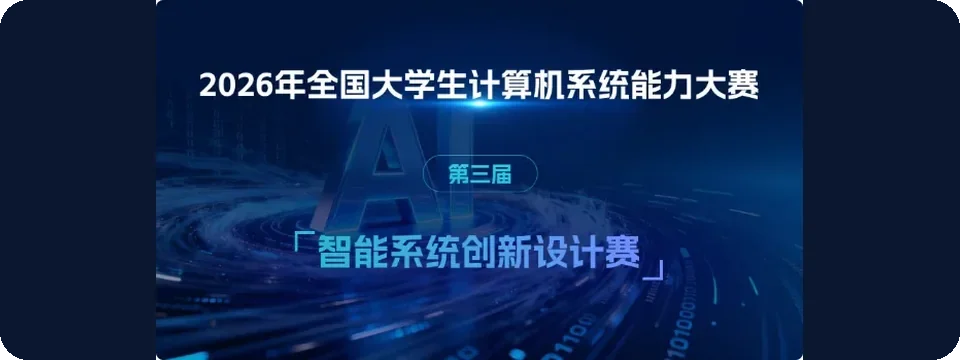
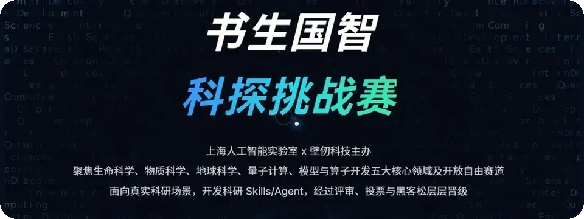

  

  <picture>
    <source media="(prefers-color-scheme: dark)" srcset="./assets/brand-threetwoa-dark.svg" />
    
  </picture>

<i>⭐ Code Less, Architect More 🚀</i>

<table width="100%">
  <tr>
    <td width="60%" valign="top">
      
你好！我是中北大学软件工程专业的准大三学生。💻&#8288;(￣▽￣)

      
这个暑假在做 Java 微服务、Python / Python AI，以及 Harness Engineering（硬约束工程）下的 AI Coding。缺少边界的纯 Vibe Coding 容易开局、难维护；我更在意架构、系统开发和可审查的长期代码。

      
⚡&#8288;(¬‿¬) 少一点一次性代码，多一点判断与 Workflow。

      
正在实践：

      <ul>
        <li><b>全链路落地：</b>产品从开发到上线；海外支付与独立开发者闭环。</li>
        <li><b>开源：</b>从自己的 repositories 和开源热点入手；关注 B 站 UP（如 IT咖啡馆）拉项目捣鼓，做二开或维护。</li>
        <li><b>评测：</b>动手评测国模（DeepSeek、GLM）；国外侧主要看 OpenAI、Anthropic 与 xAI（暂不跟 Gemini：目前已掉队）。</li>
      </ul>
      
技术之外：自行车爱好者 🚲，常看赛事；闲时写博客、经营数字花园，记录追番与随手感悟，在代码之外留一点温热。

    </td>
    <td width="40%" align="center" valign="middle">
      
    </td>
  </tr>
</table>

  <a href="mailto:laiyif68@gmail.com">邮箱</a> ·
  <a href="https://my-blogs-roan-seven.vercel.app/">博客</a> ·
  <a href="https://threetwoa-digital-garden.vercel.app/">数字花园</a>

  
  &nbsp;&nbsp;
  
  &nbsp;&nbsp;
  
  &nbsp;&nbsp;
  
  &nbsp;&nbsp;
  

---

## Agent 工作流

Coding agent 帮我做探索、调研、重复编辑和第一轮实现。日常工具是 Cursor、Claude Code、Codex；高性价比拼搭含 OpenCode Go 套餐拼车。轻量 CLI 适合快速试探；重度 IDE（Cursor）扛长期项目。比 prompt 更重要的是 harness：任务范围、仓库规则、可复现命令、测试、文档和最终 diff review。📋&#8288;(・ω・)ノ 设计判断与每一次 merge 仍由我负责。

---

## 技术栈

<table width="100%">
  <tr>
    <td width="78%" valign="top">
      
<b>前端</b> 
      
      
      
      
      
      

      
<b>Node.js / 实时通信</b> 
      
      
      
      

      
<b>Java / Spring</b> 
      
      
      
      
      
      
      
      
      

      
<b>AI / 智能体</b> 
      
      
      
      
      
      
      
      

      
<b>分布式系统</b> 
      
      

      
<b>数据 / 中间件</b> 
      
      
      
      
      
      
      

      
<b>Python / 后端</b> 
      
      
      
      
      
      
      
      

      
<b>系统 / 推理</b> 
      
      
      
      
      

      
<b>Web3</b> 
      
      

      
<b>DevOps / 可观测</b> 
      
      
      
      
      
      
      
      

    <td width="22%" align="center" valign="middle">
      <picture>
        <source media="(prefers-color-scheme: dark)" srcset="./assets/mascot-dark.gif" />
        
      </picture>
    </td>
  </tr>
</table>

---

## 竞赛

<table width="100%">
  <tr>
    <td width="50%" valign="top">
      <h3>Lead Cup · vLLM on Hygon DCU</h3>
      
2026 全国大学生计算机系统能力大赛 · 智能计算创新设计赛（先导杯）赛题 1 · 队伍翻斗花园

      
<b>最好一跑：</b>87.7839 / 100 · #26 / 132 · SLA 0 · precision 0

      
工作负载：在固定国产 DCU、concurrency=1 下提升长上下文 Qwen 吞吐，并满足 TTFT / TPOT P99 SLA（输入档 4k–8k / 8k–16k / 16k–32k）。

      
技术栈：vLLM 0.18.1 · Qwen3.5-27B BF16 · 海光 DCU（gfx936）· SCNet 实测。我负责 shared-gate 融合、SwiGLU HIP kernel、GDN launch packing、Gather-FA routing、LPK prefetch。

      
相对官方基线 smoke：TTFT P99 −61%–87% · TPOT P99 ≈ −35% · 吞吐 +7%–24%。分数以 SCNet 跑分为准，不用本地 Windows 数字顶替。

      
<a href="https://gitlab.eduxiji.net/T2026101109912321/vllm-cscc-leadcup3">赛事提交</a> · <a href="https://github.com/Aafff623/vllm-cscc-leadcup">源码镜像</a>

    </td>
    <td width="50%" valign="top">
      <h3>AI4S · 书生国智科探挑战赛</h3>
      
2026 书生国智科探挑战赛暨飞翔杯 AI Agent/Skills 开发大赛 · 上海人工智能实验室 × 壁仞科技

      
<b>队伍：</b>翻斗花园 · <b>赛道：</b>模型与算子 · <b>状态：</b>已提交，收尾中

      
问题：在壁仞 GPU 上做出可复用的 AI4S 算子与科学计算模型，对接 Intern Discovery / SCP（大赛六赛道，主线「科研数据 × AI Skills/Agent」）。我们用 Agent 辅助交付 PINN / GNN / FNO 类工具，而不是一次性 notebook。

      
已交付：完整提交并获完赛结项认定（2026-07-28）。后续做最终打磨与主办方跟进，榜单尚未公布。

      
<a href="https://ai4scompetition.intern-ai.org.cn/">赛事主页</a>

    </td>
  </tr>
  <tr>
    <td width="50%" valign="bottom" align="center">
      
    </td>
    <td width="50%" valign="bottom" align="center">
      
    </td>
  </tr>
</table>

---

## GitHub 统计

<table width="100%">
  <tr>
    <td width="60%" align="center" valign="top">
      <picture>
        <source media="(prefers-color-scheme: dark)" srcset="https://github-readme-stats-sigma-five.vercel.app/api?username=Aafff623&show_icons=true&bg_color=0d1117&title_color=58a6ff&text_color=e6edf3&icon_color=d29922&hide=prs,issues&count_private=true&hide_border=false&border_color=30363d&card_width=500" />
        
      </picture>
    </td>
    <td width="40%" align="center" valign="top">
      <picture>
        <source media="(prefers-color-scheme: dark)" srcset="https://github-readme-stats-sigma-five.vercel.app/api/top-langs/?username=Aafff623&layout=compact&bg_color=0d1117&title_color=58a6ff&text_color=e6edf3&icon_color=d29922&hide_border=false&border_color=30363d&card_width=320" />
        
      </picture>
    </td>
  </tr>
</table>

---

## 经典项目

<table width="100%">
  <tr>
    <td width="65%" valign="top">
      <h3><a href="https://github.com/San-Y108/agent-cfo">AgentCFO：DAO 资金助手</a></h3>
      
帮 DAO 运营方通过 Cobo Agentic Wallet 准备并审批资金支付，而不是靠零散表格和不透明转账。黑客松原型。

      <ul>
        <li><b>赛道：</b>Cobo · Agentic Economy × CAW</li>
        <li><b>我的角色：</b>前端负责人；落地页与演示用操作控制台</li>
        <li><b>流程：</b>贡献记录和预算规则 → 付款计划 → 确定性检查 → 人工审批 → 支付与审计报告</li>
        <li><b>证明：</b>两笔 Sepolia / SETH 支付（外部付款 + 内部转账）</li>
        <li><b>技术：</b>Next.js、TypeScript、FastAPI、Cobo CAW</li>
      </ul>
      
<a href="https://agentcfo-frontend.vercel.app/">在线演示</a> · <a href="https://github.com/San-Y108/agent-cfo">仓库</a>

      

        
        
        
        
        
        
        
        
        
      

    </td>
    <td width="35%" align="center" valign="middle">
      
    </td>
  </tr>
</table>

---

## 最近在学

- <b>AI 辅助端到端测试：</b>用 MCP 工具让模型参与 E2E，尽早抓住断裂的业务流。🔬&#8288;(・∀・)
- <b>轻量 CLI × 重度 IDE：</b>Claude Code / Kimi Code 等 CLI 做快速探索与小任务；Cursor（内置浏览器、调试、项目上下文）扛长期维护。
- <b>范式演进：</b>Prompt → Context → Harness → Loop Engineering。用人类规范和纪律收窄人机理解偏差，逼自己把架构与项目知识想清楚。🧭&#8288;(｀・ω・´)
- <b>自定义 Skill：</b>自写时效性 Skill，或借鉴优秀实践（如 Matt Pocock 的 Skill 库），划清项目边界，走向 Spec-driven Coding。
- <b>兴趣驱动的独立开发链路：</b>打通 App / 小程序 + 海外支付；用信息推动开发，在 AI 探索业务时查漏补缺。

---

## 活跃度

  <picture>
    <source media="(prefers-color-scheme: dark)" srcset="https://github-readme-activity-graph.vercel.app/graph/?username=Aafff623&bg_color=0d1117&color=58a6ff&line=58a6ff&point=d29922&hide_border=true" />
    
  </picture>

---

<i>最近更新：2026 年 8 月</i>

