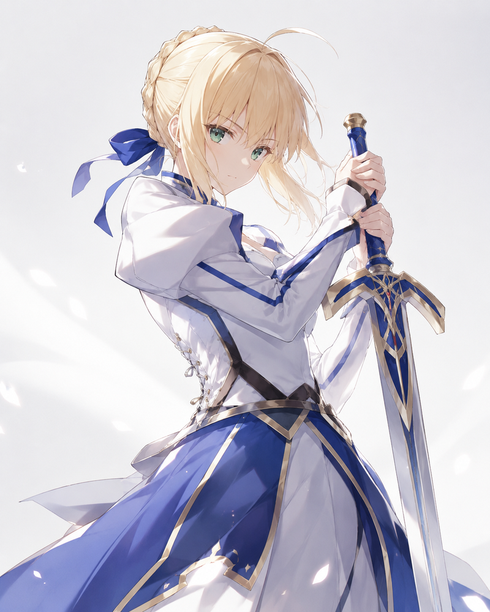

  

  <picture>
    <source media="(prefers-color-scheme: dark)" srcset="./assets/brand-threetwoa-dark.svg" />
    
  </picture>

<i>软件工程学生 · 自己做站 · 想找一份能真正上手的实习</i>

<table width="100%">
  <tr>
    <td width="60%" valign="top">
      
我是中北大学软件工程二年级学生。课余会写博客、养数字花园，也喜欢把小项目做到能打开的地址上，而不是只停在作业文件夹里。

      
兴趣比较杂：记笔记、捣鼓前端和一点 Web3、看动画、把日常碎片丢进花园。更在意的是亲手交付东西，别人点开链接就能用。

      
现阶段更像独立开发者：自己选题、自己上线、自己维护。接下来想找一份能真正上手的实习，进一个认真做产品的小队，能看见用户反馈，也能把代码和判断练扎实。理想状态是小队在乎发出去的东西，而不是只堆 PPT。

      
<b>Agentic Workflow：</b>先让 agent 帮我铺开探索和草稿，实现阶段把脏活跑掉，再用一轮 review 挑毛病。Skills、MCP 和文档跟仓库放一起，是为了下次少重来。合不合、发不发，最后还是我拍板。

    </td>
    <td width="40%" align="center" valign="middle">
      
    </td>
  </tr>
</table>

  <b>🔗 项目快链：</b>
  <a href="https://agentcfo-frontend.vercel.app/">AgentCFO</a> ·
  <a href="https://my-blogs-roan-seven.vercel.app/">博客</a> ·
  <a href="https://threetwoa-digital-garden.vercel.app/">数字花园</a>

---

## 🏆 竞赛与训练营

<table width="100%">
  <tr>
    <td width="50%" valign="top">
      <h3>⚡ Lead Cup · vLLM on Hygon DCU</h3>
      
<b>已结束。</b>2026 全国大学生计算机系统能力大赛 · 领跑杯第 1 题。与队伍 <b>翻斗花园</b> 一起，在固定海光 DCU（gfx936）上优化 vLLM 0.18.1 推理 Qwen3.5-27B。我负责 kernel 级融合与 decode/prefill 路由——不是只拧配置。

      
<b>成绩：</b>最好一跑 <b>87.7839 / 100</b> · <b>#26 / 132</b> SLA 0 · precision 0

      <ul>
        <li><b>工作：</b>fused shared-gate · gate-up ⊕ SwiGLU HIP kernel · GDN packed launch · Gather-FA routing · LPK prefetch</li>
        <li><b>收益：</b>相对官方基线 smoke — TTFT P99 −61%～−87% · TPOT P99 ≈ −35% · 吞吐 +7%～+24%</li>
      </ul>
      
<a href="https://github.com/Aafff623/vllm-cscc-leadcup">GitHub</a> · <a href="https://gitlab.eduxiji.net/T2026101109912321/vllm-cscc-leadcup3">GitLab 提交</a>

    </td>
    <td width="50%" valign="top">
      <h3>🔬 AI4S · 书生国智科探挑战赛</h3>
      
<b>进行中 · 已报名。</b>上海人工智能实验室 × 壁仞 · 赛道 <b>模型与算子</b>（壁仞飞翔杯）。队伍 <b>翻斗花园</b>（5 人，与 Lead Cup 同队名）；我是 <b>队员，不是队长</b>。

      
赛制面向真实科研场景的 Skills / Agents：海选 → SCP 广场投票 → 后续轮次 / 黑客松。赛道落在壁仞 GPU 上——Agent 辅助的科学模型与算子（PINN / GNN / FNO 一类计算，外加算子工程）。海选开发尚未开始；上传窗口大约在 7 月下旬，目标是做出能上 SCP 广场、给科研用户试用的东西。

      
<a href="https://ai4scompetition.intern-ai.org.cn/">赛事主页</a>

    </td>
  </tr>
  <tr>
    <td width="50%" valign="top">
      <h3>📱 HarmonyOS · C4 高校创新赛</h3>
      
<b>暂定 · 尚未写成已报名硬事实。</b>瞄准方向 <b>04 操作系统智能创新</b>，挂在 C4 鸿蒙赛道下（第九届中国高校计算机大赛—人工智能创意赛 / 华为 × 浙江大学）。三人队，来自与翻斗花园同一批系统类竞赛同学；我是 <b>队员，不是队长</b>。

      
若确定参赛：异构调度、跨端通信，以及提升系统侧 AI 效率与多设备协同的感知数据流——更接近 OS 管道，而不是消费级应用。若进入，交付仍按 C4 六大件（演示系统 + 文档 / 视频 / PPT 等）。

      
<a href="https://developer.huawei.com/home/C4-AI">C4-AI 页面</a>

    </td>
    <td width="50%" valign="top">
      <h3>⛓️ Monad Builder Camp</h3>
      
<b>进行中 · 第 2 周。</b>正式名称：Web3 暑期实习计划 · Monad Builder Camp——四周实战型成长计划，在 Monad 上做出第一个可展示的链上产品（Demo / Repo / 研究或运营材料 / 作品集），再进入黑客松周；可选第 5 周整理作品集。

      
结构大致是三周共学、分轨与协作，再进入黑客松。第 2 周是 <b>Builder 分轨</b>（Tech / Ops / Research）；我还没定死走哪条轨。手册把产品闭环写得很具体：<a href="https://web3intern.xyz/zh/">web3intern.xyz</a>。

    </td>
  </tr>
</table>

---

## 技术栈

<table width="100%">
  <tr>
    <td width="78%" valign="top">
      
<b>前端</b> 
      
      
      
      
      
      
      
      
      
      

      
<b>Java / Spring</b> 
      
      
      
      
      
      
      
      
      

      
<b>数据 / 中间件</b> 
      
      
      
      
      
      

      
<b>Python / API</b> 
      
      

      
<b>系统 / 推理</b> 
      
      
      
      
      

      
<b>Web3</b> 
      
      
      

      
<b>DevOps / 可观测</b> 
      
      
      
      
      
      
      
      
      

    </td>
    <td width="22%" align="center" valign="middle">
      <picture>
        <source media="(prefers-color-scheme: dark)" srcset="./assets/mascot-dark.gif" />
        
      </picture>
    </td>
  </tr>
</table>

---

## 📊 GitHub 统计

<table width="100%">
  <tr>
    <td width="60%" align="center" valign="top">
      <picture>
        <source media="(prefers-color-scheme: dark)" srcset="https://github-readme-stats-sigma-five.vercel.app/api?username=Aafff623&show_icons=true&bg_color=0d1117&title_color=58a6ff&text_color=e6edf3&icon_color=d29922&hide=prs,issues&count_private=true&hide_border=false&border_color=30363d&card_width=500" />
        
      </picture>
    </td>
    <td width="40%" align="center" valign="top">
      <picture>
        <source media="(prefers-color-scheme: dark)" srcset="https://github-readme-stats-sigma-five.vercel.app/api/top-langs/?username=Aafff623&layout=compact&bg_color=0d1117&title_color=58a6ff&text_color=e6edf3&icon_color=d29922&hide_border=false&border_color=30363d&card_width=320" />
        
      </picture>
    </td>
  </tr>
</table>

---

## 📦 经典项目

<table width="100%">
  <tr>
    <td width="65%" valign="top">
      <h3><a href="https://github.com/San-Y108/agent-cfo">AgentCFO：DAO 资金助手</a></h3>
      
<i>一个黑客松项目：准备、检查、审批并发送 DAO 付款。</i>

      
AgentCFO 读取贡献记录与预算规则，生成付款计划，跑确定性风险检查，等人审批后，通过 <strong>Cobo Agentic Wallet (CAW)</strong> 打出已批准的款项，并为每次运行生成审计报告。

      <ul>
        <li><b>黑客松赛道：</b>Cobo · Agentic Economy × CAW</li>
        <li><b>我的角色：</b>前端负责人，负责落地页与控制台 demo</li>
        <li><b>已验证：</b>两笔 Sepolia / SETH 打款，覆盖外部付款与内部转账</li>
      </ul>
      
<a href="https://agentcfo-frontend.vercel.app/">在线演示</a> · <a href="https://github.com/San-Y108/agent-cfo">仓库</a>

      

        
        
        
        
        
        
        
        
        
      

    </td>
    <td width="35%" align="center" valign="middle">
      
    </td>
  </tr>
</table>

---

## 📖 最近在学

- <b>系统 / 推理：</b>vLLM scheduler 与 attention backends、gfx936 上 decode-bound kernel profiling，以及固定 SLA 下 TTFT / TPOT / 吞吐的取舍
- <b>科学计算与算子：</b>壁仞 GPU 上 Agent 辅助的 PINN / GNN / FNO 一类模型工作与算子工程
- <b>操作系统 / 多端：</b>异构调度、跨端通信，以及面向系统侧 AI 效率的感知数据流（鸿蒙侧）
- <b>Web3：</b>Smart Account 与 Session Key 模式、Monad 链上产品闭环，以及测试网 demo 与主网级 UX 之间的差距
- <b>AI 辅助开发：</b>把一次性 prompt 收成可复用的 Skills / MCP 工具，以及能抓住自己失误的复查闭环
- <b>前端：</b>把一个 Next.js 应用交付并养下去，而不是每次从 starter 重开

---

## 📈 活跃度

  <picture>
    <source media="(prefers-color-scheme: dark)" srcset="https://github-readme-activity-graph.vercel.app/graph/?username=Aafff623&bg_color=0d1117&color=58a6ff&line=58a6ff&point=d29922&hide_border=true" />
    
  </picture>

---

## 📫 联系

<i>可以通过邮件或下面任一链接联系我。</i>

  
  &nbsp;&nbsp;
  
  &nbsp;&nbsp;
  
  &nbsp;&nbsp;
  
  &nbsp;&nbsp;
  
  &nbsp;&nbsp;
  
  &nbsp;&nbsp;
  
  &nbsp;&nbsp;
  
  &nbsp;&nbsp;
  

---

<i>最近更新：2026 年 7 月</i>

